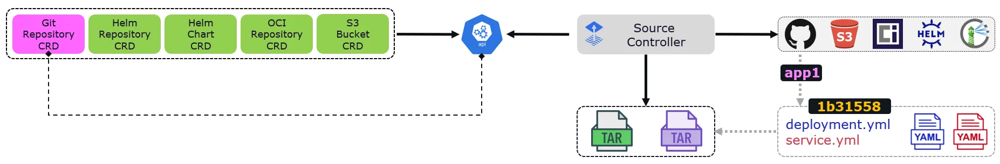
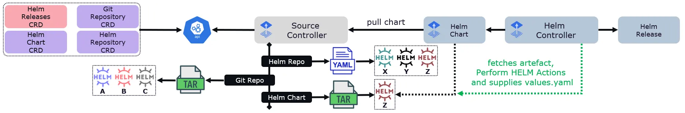
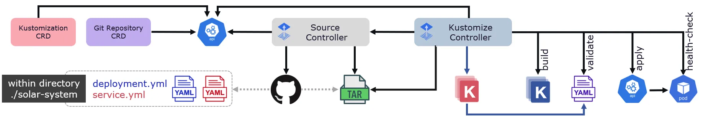
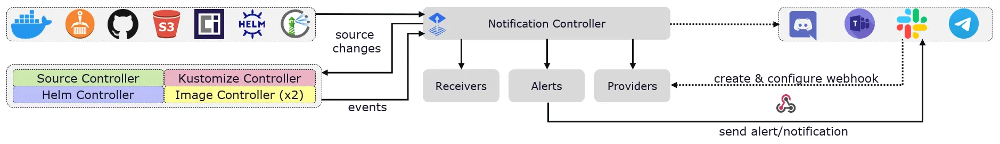
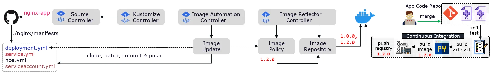

# 10 GitOps (Flux CD/Flagger/Istio/Argo CD)

## Flux CD v2

Компоненты (GitOps Toolkit):

### Source controller


Этот контроллер обеспечивает интерфейс для обращения к различным источникам манифестов или Helm-чартов. Он постоянно отслеживает (по умолчанию, каждую минуту) изменения в них, например, новые или обновленные манифесты, и автоматически загружает их и сохраняет у себя в виде артефакта для дальнейшей установки в кластер. Поддерживаемые типы источников:
- Bucket (корзина S3)
- GitRepository
- OCIRepository
- HelmRepository (OCI или по умолчанию HTTP/S)

### Helm controller

Позволяет управлять релизами Helm-чартов декларативно через манифесты. 
Функции контроллера:
1) Отслеживает HelmRelease объекты и генерирует HelmChart-ресурсы
2) Поддерживает HelmChart артефакты
3) Выбирает артефакты, загруженные Source controller'ом из HelmChart объектов
4) Отслеживает объекты HelmChart на наличие изменений редакций (включая диапазоны semver для чартов из источников HelmRepository)
5) Выполняет автоматические действия Helm, включая тестирование, откат и удаление
6) Предлагает обширные возможности конфигурации для автоматического исправления (откат, удаление, повторная попытка) при неудачных действиях по установке, обновлению или тестированию
7) Запускает установку/обновление в определенном порядке, принимая во внимание зависимость, определенную в HelmRelease
8) Удаляет ненужные релизы Helm-чартов из кластера (сборка мусора)
9) Публикует статусы релизов Helm-чартов
10) Применяет встроенный Kustomize-совместимый пост-рендеринг Helm, обеспечивающий поддержку стратегического слияния, JSON 6902 и исправлений образов

Желаемое состояние Helm-релиза описывается через CRD "HelmRelease" (hr), который содержит описание:
- опциональной зависимости от другого HelmRelease (порядок установки)
- сгенерированного Helm-чарта (ссылается на HelmRepository/GitRepository/Bucket)   

Создание, изменение или удаление ресурса HelmRelease инициирует соответствующее действия в Helm controller'e.

### Kustomize controller

Выполняет следущие операции: 
1) Валидирует файлы манифестов из артефакта (dry-run) 
2) Согласовывает (reconcillation) состояние ресурсов кластера и Git-репозитория, который предоставляется Source controller'ом
3) Создает манифесты с помощью Kustomize (из простых YAML-файлов Kubernetes или overlays Kustomize), патчи и применяет их
4) Расшифровывает секреты Kubernetes с помощью Mozilla SOPS и KMS
5) Проверяет манифесты на соответствие API Kubernetes
6) Исполняет от имени ServiceAccount'ов (мультиарендный RBAC)
7) Оценивает работоспособность развернутых рабочих нагрузок
8) Запускает конвейеры в определенном порядке (зависит от отношений)
9) Уничтожает объекты кластера, удаленные из источника (сборка мусора)
10) Сообщает об изменениях состояния кластера (для передачи их Notification controller'у)

Желаемое состояние манифестов приложения описывается через CRD "Kustomization" (ks) (kustomize.toolkit.fluxcd.io/v1).
Он содержит настройку:
- зависимости от другого Kustomization (порядок установки)
- интервала сравнения состояния (10 мин. по умолчанию)
- имени и типа источника
- путь к манифестам или kustomization.yml ("Kustomize") в загруженном из источника артефакте
- включения сборки мусора (удаление ресурса из кластера, если он удален в источнике)

### Notification controller

Это компонент, который отправляет уведомления по событиям, происходящим в системе Flux CD. Контроллер уведомлений может отправлять сообщения по различным каналам, таким как Slack, электронная почта или другие платформы обмена сообщениями, чтобы информировать членов команды об изменениях статуса развертывания приложений. Ресурс Alert определяет о каких событиях, как информировать и в какой канал,
настраиваемый через ресурс Provider.

### Image Reflector/Automation controller

Автоматически обновляет манифесты Kubernetes последним доступным образом контейнера из реестра. Контроллер Image Reflector отслеживает указанный реестр образов контейнеров на наличие обновлений и изменяет соответствующие ресурсы на последний тег образа.

Примеры команд flux cli:  
`flux get sources git -n default` - список контролируемых Git-репозиториев в неймспейсе  
`flux get kustomizations` - список "конвееров" развертывания в неймспейсе flux-system  
`flux get helmreleases -n big-app` - список релизов Helm-чартов в неймспейсе big-app  
`flux reconcile kustomization [name]` - принудительная инициация сравнения состояния  
`flux suspend kustomization [name]` - остановка согласования актуального и желаемого состояний  
`flux resume kustomization [name]` - отмена остановки согласования актуального и желаемого состояний  
`flux delete kustomization [name]` - удаление "конвеера" развертывания и удаление всех ресурсов, разворачиваемых через него (при включенном prune). 
Если не удалить манифест конвеера из источника откуда он устанавливался, то через определённое время "конвеер" восстановится из источника.

## Установка Flux CD (bootstrap) для проекта в GitLab

Предварительно создадим Personal Access Token (PAT) с ролью owner и правами api через Web-интерфейс профиля на платформе Gitlab.com.

Полученный PAT введем в интерактив команды:
```
flux bootstrap gitlab --deploy-token-auth --components-extra=image-reflector-controller,image-automation-controller --owner=RimiX2 --repository=flux-cd --branch=main --path=clusters/okt-dd --personal
```

Команда `bootstrap` делает следующее:

- Создает токен развертывания и сохраняет его как Kubernetes secret
- Создает пустой проект GitLab, если проект, указанный в опции --repository, не существует
- Генерирует файлы манифестов для основных компонентов системы Flux для проекта (включая дополнительные компоненты)
- Применяет сгенерированные манифесты к кластеру
- Фиксирует эти манифесты в указанную ветвь и отправляет в репозиторий проекта в GitLab

Проверим работу Flux CD. Для этого создадим новые ресурсы "deployment" и "service" для развертывания тестового приложения "podinfo" и отправим их в "инфраструктурный" [репозиторий](https://gitlab.com/RimiX2/flux-cd) с которым Flux CD ранее был настроен (bootstrap):
```
git clone https://gitlab.com/RimiX2/flux-cd
cd flux-cd
mkdir clusters/okt-dd/default

cat <<EOF > clusters/okt-dd/default/podinfo-deployment.yaml
apiVersion: apps/v1
kind: Deployment
metadata:
  name: podinfo
  namespace: default
spec:
  selector:
    matchLabels:
      app: podinfo
  template:
    metadata:
      labels:
        app: podinfo
    spec:
      containers:
        - name: podinfod
          image: ghcr.io/stefanprodan/podinfo
          imagePullPolicy: IfNotPresent
          ports:
            - name: http
              containerPort: 9898
              protocol: TCP
EOF

cat <<EOF > clusters/okt-dd/default/podinfo-service.yaml
apiVersion: v1
kind: Service
metadata:
  name: podinfo
  namespace: default
spec:
  selector:
    matchLabels:
      app: podinfo
  type: ClusterIP
  ports:
  - name: http
    port: 8080
    targetPort: 9898
EOF

git add -A && git commit -m "Add podinfo application"
git push
```

Проверим, что новые ресурсы приложения "pod-info" установились:
```
kubectl get all -n default
NAME                          READY   STATUS    RESTARTS   AGE
pod/podinfo-776dcbd88-g5m7d   1/1     Running   0          98m

NAME                 TYPE        CLUSTER-IP       EXTERNAL-IP   PORT(S)    AGE
service/kubernetes   ClusterIP   10.96.0.1        <none>        443/TCP    30h
service/podinfo      ClusterIP   10.102.221.124   <none>        8080/TCP   6m56s

NAME                      READY   UP-TO-DATE   AVAILABLE   AGE
deployment.apps/podinfo   1/1     1            1           98m

NAME                                DESIRED   CURRENT   READY   AGE
replicaset.apps/podinfo-776dcbd88   1         1         1       98m
```

## Организация доставки микросервисного приложения "microservices-demo"

За основу возьмем [репозиторий](https://github.com/GoogleCloudPlatform/microservices-demo) .
Cкопируем его в новый [репозиторий](https://gitlab.com/RimiX2/microservices-demo) в GitLab.

### Развертывание из манифестов

Создадим новую папку в инфраструктурном репозитории:
```
mkdir clusters/okt-dd/microservices-demo
```

Создадим отдельный неймспейс:
```
kubectl create ns microservices-demo
```

Создание манифеста нового источника Git (публичный репозиторий) приложения "microservices-demo" для контроля изменений:
```
flux create source git microservices-demo -n microservices-demo --url=https://gitlab.com/RimiX2/microservices-demo --branch=master --interval=30s --export > clusters/okt-dd/microservices-demo/md-source.yaml
```
Фиксация созданного манифеста и отправка в инфраструктурный репозиторий:
```
git add -A && git commit -m "Add microservices-demo GitRepo"
git push
```

Создание манифеста "конвеера" Kustomization для непрерывного развертывания:
```
flux create kustomization microservices-demo --target-namespace=microservices-demo --source=GitRepository/microservices-demo --path="./release/kubernetes-manifests.yaml" --prune=true --interval=1m --export > clusters/okt-dd/microservices-demo/md-kustomization.yaml
```
Фиксация созданного манифеста и отправка в инфраструктурный репозиторий:
```
git add -A && git commit -m "Add microservices-demo Kustomization from manifests"
git push
```

### Развертывание из Helm-чартов

Остановим предыдущий "конвеер" и удалим всю рабочую нагрузку:
```
flux suspend ks microservices-demo -n microservices-demo
kubectl delete ns microservices-demo
```

Подготовим новую ветку "feature/separate-charts" в репозитории , в которой разделим один большой чарт на отдельные чарты микросервисов c параметризацией версий образов.


Создадим новую папку в инфраструктурном репозитории:
```
mkdir clusters/okt-dd/microservices-demo-charts
```

Создадим отдельный неймспейс:
```
kubectl create ns microservices-demo-charts
```

Создание манифеста нового источника Git (публичный репозиторий) чартов приложения "microservices-demo" со cсылкой на ветку "feature/separate-charts" для контроля изменений:
```
flux create source git microservices-demo -n microservices-demo-charts --url=https://gitlab.com/RimiX2/microservices-demo --branch=feature/separate-charts --interval=30s --export > clusters/okt-dd/microservices-demo-charts/md-source.yaml
```
Фиксация манифеста и отправка в инфраструктурный репозиторий:
```
git add -A && git commit -m "Add microservices-demo charts GitRepo"
git push
```

Установка нового источника Helm-чартов приложения "microservices-demo":
```
apply -f clusters/okt-dd/microservices-demo-charts/md-source.yaml
```

Создание манифестов "HelmRelease" для установки и управления жизненым циклом чартов приложения "microservices-demo":

```
flux create hr redis-cart -n microservices-demo-charts --target-namespace=microservices-demo-charts --interval=1m --source=GitRepository/microservices-demo --chart=./helm-charts/redis-cart --export > clusters/okt-dd/microservices-demo-charts/redis-cart-helmrelease.yaml
flux create hr cartservice -n microservices-demo-charts --target-namespace=microservices-demo-charts --interval=1m --source=GitRepository/microservices-demo --chart=./helm-charts/cartservice --export > clusters/okt-dd/microservices-demo-charts/cartservice-helmrelease.yaml
flux create hr adservice -n microservices-demo-charts --target-namespace=microservices-demo-charts --interval=1m --source=GitRepository/microservices-demo --chart=./helm-charts/adservice --export > clusters/okt-dd/microservices-demo-charts/adservice-helmrelease.yaml
flux create hr checkoutservice -n microservices-demo-charts --target-namespace=microservices-demo-charts --interval=1m --source=GitRepository/microservices-demo --chart=./helm-charts/checkoutservice --export > clusters/okt-dd/microservices-demo-charts/checkoutservice-helmrelease.yaml
flux create hr currencyservice -n microservices-demo-charts --target-namespace=microservices-demo-charts --interval=1m --source=GitRepository/microservices-demo --chart=./helm-charts/currencyservice --export > clusters/okt-dd/microservices-demo-charts/currencyservice-helmrelease.yaml
flux create hr emailservice -n microservices-demo-charts --target-namespace=microservices-demo-charts --interval=1m --source=GitRepository/microservices-demo --chart=./helm-charts/emailservice --export > clusters/okt-dd/microservices-demo-charts/emailservice-helmrelease.yaml
flux create hr frontend -n microservices-demo-charts --target-namespace=microservices-demo-charts --interval=1m --source=GitRepository/microservices-demo --chart=./helm-charts/frontend --export > clusters/okt-dd/microservices-demo-charts/frontend-helmrelease.yaml
flux create hr loadgenerator -n microservices-demo-charts --target-namespace=microservices-demo-charts --interval=1m --source=GitRepository/microservices-demo --chart=./helm-charts/loadgenerator --export > clusters/okt-dd/microservices-demo-charts/loadgenerator-helmrelease.yaml
flux create hr paymentservice -n microservices-demo-charts --target-namespace=microservices-demo-charts --interval=1m --source=GitRepository/microservices-demo --chart=./helm-charts/paymentservice --export > clusters/okt-dd/microservices-demo-charts/paymentservice-helmrelease.yaml
flux create hr productcatalogservice -n microservices-demo-charts --target-namespace=microservices-demo-charts --interval=1m --source=GitRepository/microservices-demo --chart=./helm-charts/productcatalogservice --export > clusters/okt-dd/microservices-demo-charts/productcatalogservice-helmrelease.yaml
flux create hr recommendationservice -n microservices-demo-charts --target-namespace=microservices-demo-charts --interval=1m --source=GitRepository/microservices-demo --chart=./helm-charts/recommendationservice --export > clusters/okt-dd/microservices-demo-charts/recommendationservice-helmrelease.yaml
flux create hr shippingservice -n microservices-demo-charts --target-namespace=microservices-demo-charts --interval=1m --source=GitRepository/microservices-demo --chart=./helm-charts/shippingservice --export > clusters/okt-dd/microservices-demo-charts/shippingservice-helmrelease.yaml
```

Фиксация манифестов и отправка в инфраструктурный репозиторий:
```
git add -A && git commit -m "Add microservices-demo from charts"
git push
```

Применение созданных манифестов HelmRelese и просмотр их состояния:
```
kubectl apply -f clusters/okt-dd/microservices-demo-charts/
flux get hr -n microservices-demo-charts
```

Внесем небольшое изменение в микросервис frontend:

```
cd .\src\frontend\
sed -i 's|Online Boutique|Hipster Shop|' templates/header.html
```

И выпустим "новый" образ :

```
docker login registry.gitlab.com
docker build -t registry.gitlab.com/rimix2/microservices-demo/frontend:0.0.1 .
docker push registry.gitlab.com/rimix2/microservices-demo/frontend:0.0.1
```

Изменим чарт "frontend", указав в нем версию образа 0.0.1 с gitlab.com, и версию самого чарта 0.0.2  и отправим изменения в репозиторий "microservices-demo":
```
cd .\helm-charts\frontend\
sed -i 's|version: 0.0.1|version: 0.0.2|' Chart.yaml
sed -i 's|appVersion: v0.8.1|version: 0.0.1|' Chart.yaml
sed -i 's|gcr.io/google-samples/microservices-demo/frontend|registry.gitlab.com/rimix2/microservices-demo/frontend|' values.yaml
sed -i 's|tag: v0.8.1|tag: 0.0.1|' values.yaml
```

Проверим, что Helm-release "frontend" успешно обновился до версии 0.0.2:
```
flux get hr frontend -n microservices-demo-charts
NAME       AGE   READY   STATUS
frontend   40h   True    Helm upgrade succeeded for release microservices-demo-charts/microservices-demo-charts-frontend.v2 with chart frontend@0.0.2
```

## Flagger 

### Progressive delivery (Canary, A/B Testing, Blue/Green)

Argo CD использует Argo Rollouts, который является расширением. После установки объект «Rollout» становится полной заменой стандартного объекта «Deployment», 
но предоставляет дополнительные стратегии развертывания, такие как «Blue/Green» и «Canary».

