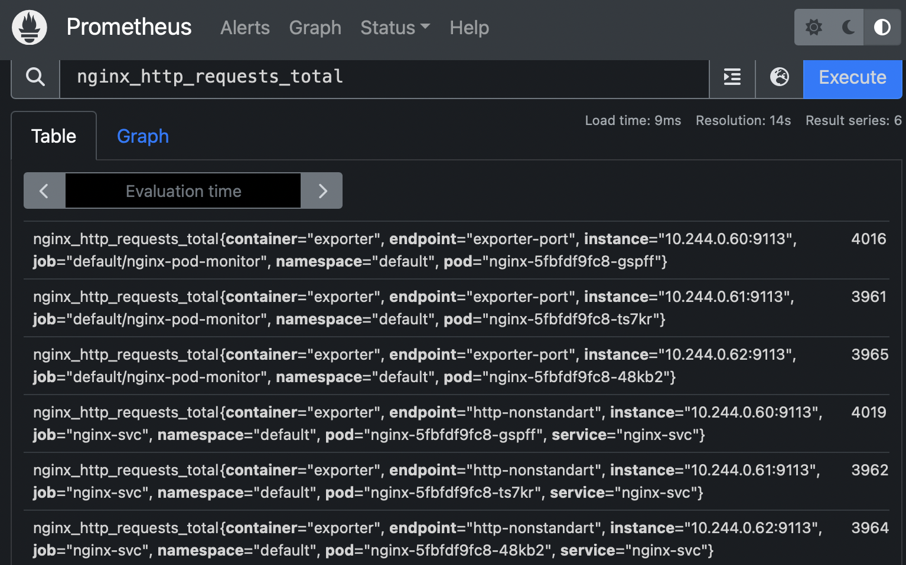
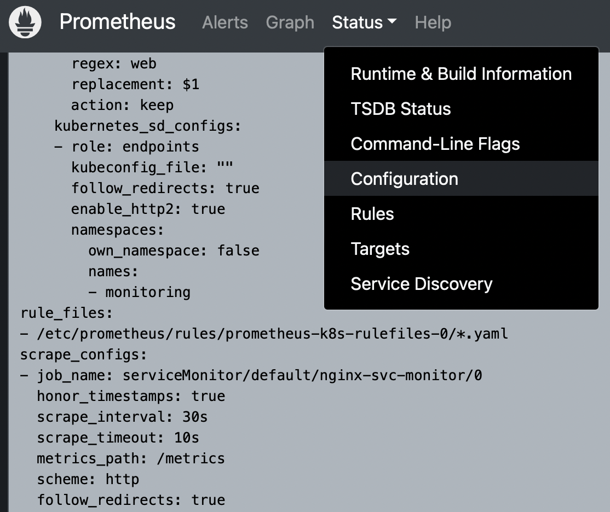
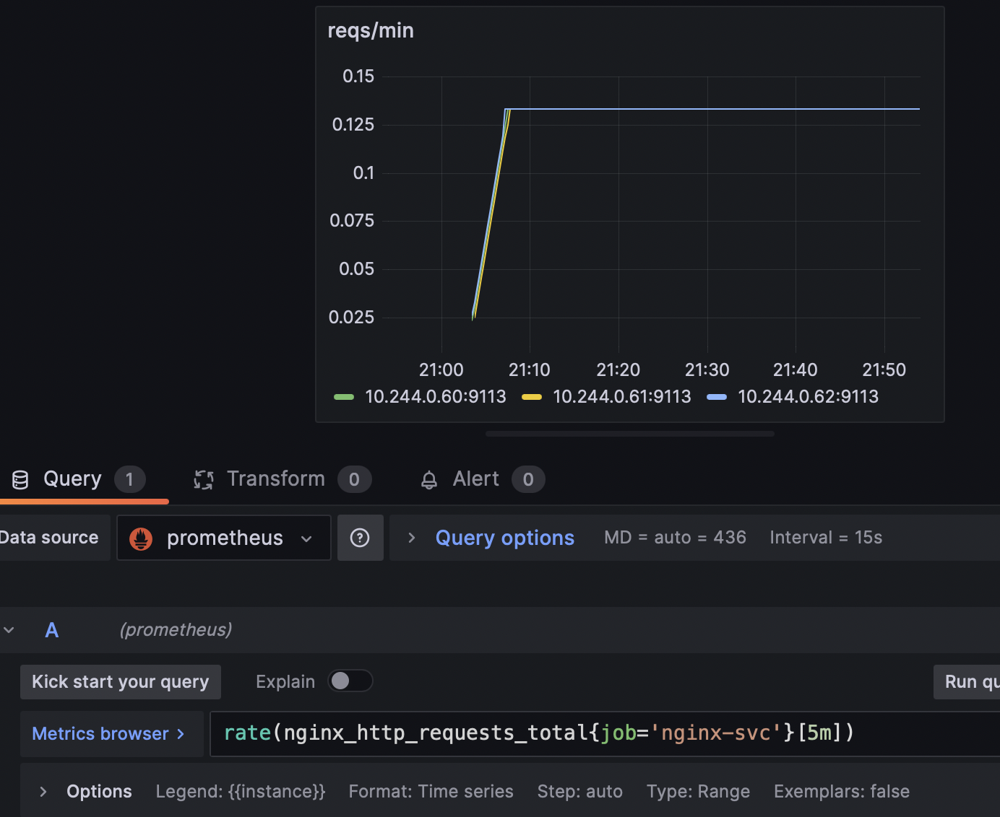

# 8 (kubernetes-monitoring) - minikube

## Prometheus Operator

Установка из репозитория:
https://github.com/prometheus-operator/kube-prometheus.git

Репозиторий содержит сборник типичных манифестов для установки оператора, экземляра Prometheus, экспортера узла и Grafana. Экзепляр уже настроен следить за всеми "мониторами" во всех неймспейсах в кластере. В его составе есть кластерная роль и связанный с ней сервис-аккаунт, необходимые для работы.

### Создание отдельного неймспейса для сервисов мониторинга и установка необходимых для его работы CRD
kubectl create -f manifests/setup

### Ожидание появления CRD для "ServiceMonitor". Сообщение "No resources found" будет означать конец ожидания
until kubectl get servicemonitors --all-namespaces ; do date; sleep 1; echo ""; done

### Установка ресурсов сборника
kubectl create -f manifests/

## Опытное развертывание

Устанавливается экземпляр nginx в неймспейсе default.

Проект nginx-exporter позволяет "снять" метрики со stub nginx и представить её в формате Prometheus.

`nginx/configmap.yml` - конфигурационный файл c ресурсом stub  
`nginx/deployment.yml` - развертывание nginx на порту 80 и экспортера на порту 9113 в качестве сайд-кара, снимающего статистку с него
`nginx/service.yml` - сервис для работы "монитора" сервисов с портами 80/8080 для nginx/exporter соответственно  

## PodMonitor/ServiceMonitor

`prometheus/podMonitor.yml` - ресурс оператора Prometheus, собирающий метрики со всех подов с определенным лейбл-селектором
`prometheus/serviceMonitor.yml`- ресурс оператора Prometheus, собирающий метрики со всех сервисов с определенным лейбл-селектором

Просмотр опрашиваемых "таргет"ов и примененных "джоб"ов, сконфигурированных ресурсами мониторов для экземпляра Prometheus.

```
kubectl --namespace monitoring port-forward svc/prometheus-k8s 9090
```



## Grafana-дашборд

Настройка дашборда для Grafana через его UI.
```
kubectl --namespace monitoring port-forward svc/grafana 3000
```

